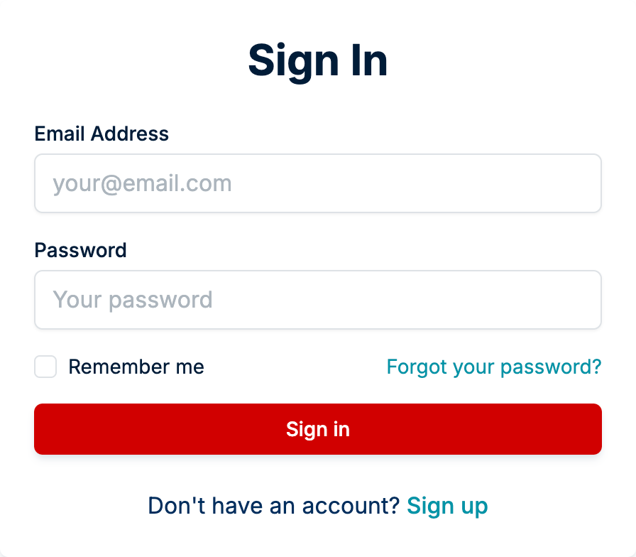

# looks-same Benchmark

This benchmark evaluates the performance of four npm packages for image comparison: [`looks-same`](https://github.com/gemini-testing/looks-same), [`pixelmatch`](https://github.com/mapbox/pixelmatch), [`resemblejs`](https://github.com/rsmbl/Resemble.js), and [`blink-diff`](https://github.com/yahoo/blink-diff).  
It focuses on execution speed across diverse test cases, including real-world web comparisons and synthetic examples.

---

## Test Cases

### Web-Based Averages

- **Web Avg Diff (672x623)**:  
  Aggregates **failed web page comparisons** from our production projects using [Testplane](https://testplane.io/) for e2e testing.  
  Represents 103,142 real-world UI mismatches (e.g., layout shifts, rendering errors).
- **Web Avg Success (656x547)**:  
  Derived from 6,282,752 successful comparisons in production.  
  Tests speed for "no difference" scenarios common in regression testing workflows.

### Synthetic Comparisons

- **Equal Images (1000x1000)**: Baseline test with identical images.
- **1% Visible Diff (1000x1000)**:  
  Human-noticeable differences (ΔE ≥ 2.3 in [CIEDE2000](https://en.wikipedia.org/wiki/Color_difference#CIEDE2000)).
- **10% Visible Diff (1000x1000)**:  
  Larger-scale variations with the same perceptual thresholds.
- **Full Max Diff (1000x1000)**:  
  All pixels altered (maximum difference) to stress-test worst-case performance.

### Realistic Example

- **Demonstrative Example (896×784)**:  
  Real-world UI comparison with an 8% visible difference: a button intentionally recolored to a human-noticeable shade.  
  Provides visual intuition for typical failure scenarios.  
  <details>
    <summary>Uses the following images (from ./fixtures)</summary>
    
    <table>
      <tr>
        <td></td>
        <td></td>
      </tr>
    </table>
  </details>
  

---

## Results

See [**results.md**](./results.md) for execution times across all test cases.  

## Running the benchmark

1. Clone the repository:
   ```bash
   git clone git@github.com:gemini-testing/looks-same.git
   ```
2. Navigate to "benchmark" directory:
   ```bash
   cd looks-same/benchmark
   ```
3. Install dependencies:
   ```bash
   npm ci
   ```
4. Run the benchmark:
   ```bash
   npm start
   ```
